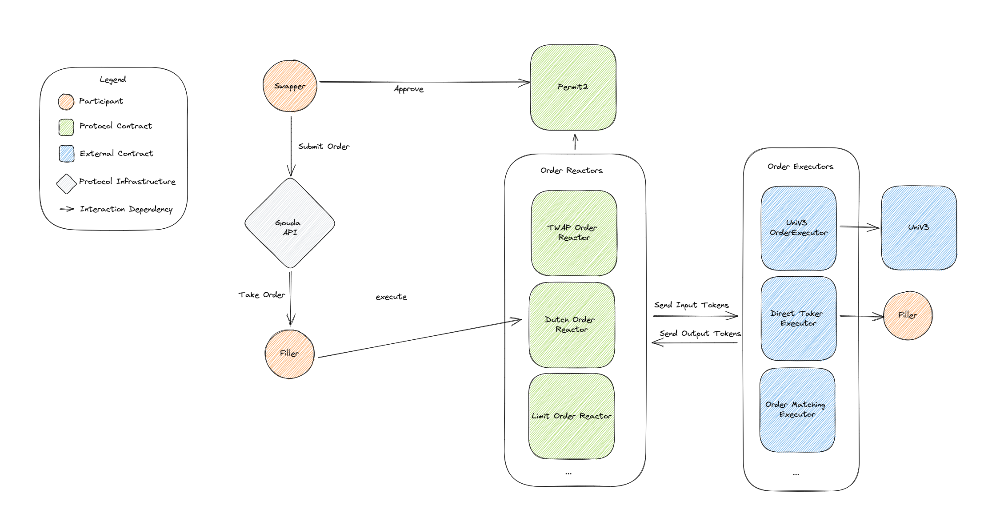

# UniswapX

[](https://github.com/Uniswap/uniswapx/actions/workflows/test-integration.yml)
[](https://github.com/Uniswap/uniswapx/actions/workflows/test.yml)

UniswapX is an ERC20 swap settlement protocol that provides swappers with a gasless experience, MEV protection, and access to arbitrary liquidity sources. Swappers generate signed orders which specify the specification of their swap, and fillers compete using arbitrary fill strategies to satisfy these orders.


## UniswapX Protocol Architecture



### Reactors

Order Reactors _settle_ UniswapX orders. They are responsible for validating orders of a specific type, resolving them into inputs and outputs, and executing them against the filler's strategy, and verifying that the order was successfully fulfilled.

Reactors process orders using the following steps:
- Validate the order
- Resolve the order into inputs and outputs
- Pull input tokens from the swapper to the fillContract using permit2 `permitWitnessTransferFrom` with the order as witness
- Call `reactorCallback` on the fillContract
- Transfer output tokens from the fillContract to the output recipients

Reactors implement the [IReactor](./src/interfaces/IReactor.sol) interface which abstracts the specifics of the order specification. This allows for different reactor implementations with different order formats to be used with the same interface, allowing for shared infrastructure and easy extension by fillers.

Current reactor implementations:
- [LimitOrderReactor](./src/reactors/LimitOrderReactor.sol): A reactor that settles simple static limit orders
- [DutchOrderReactor](./src/reactors/DutchOrderReactor.sol): A reactor that settles linear-decay dutch orders
- [ExclusiveDutchOrderReactor](./src/reactors/ExclusiveDutchOrderReactor.sol): A reactor that settles linear-decay dutch orders with a period of exclusivity before decay begins

### Fill Contracts

Order fillContracts _fill_ UniswapX orders. They specify the filler's strategy for fulfilling orders and are called by the reactor with `reactorCallback` when using `executeWithCallback` or `executeBatchWithCallback`.

Some sample fillContract implementations are provided in this repository:
- [SwapRouter02Executor](./src/sample-executors/SwapRouter02Executor.sol): A fillContract that uses UniswapV2 and UniswapV3 via the SwapRouter02 router

### Direct Fill

If a filler wants to simply fill orders using funds held by an address rather than using a fillContract strategy, they can do so gas efficiently by using `execute` or `executeBatch`. These functions cause the reactor to skip the `reactorCallback` and simply pull tokens from the filler using `msg.sender`.

# Integrating with UniswapX
Jump to the docs for [Creating a Filler Integration](https://docs.uniswap.org/contracts/uniswapx/guides/createfiller).

# Deployment Addresses

## Ethereum Mainnet

| Contract                      | Address                                                                                                               | Source                                                                                                                    |
| ---                           | ---                                                                                                                   | ---                                                                                                                       |
| V2 Dutch Order Reactor        | [0x00000011F84B9aa48e5f8aA8B9897600006289Be](https://etherscan.io/address/0x00000011F84B9aa48e5f8aA8B9897600006289Be) | [V2DutchOrderReactor](https://github.com/Uniswap/UniswapX/blob/v2.0.0/src/reactors/V2DutchOrderReactor.sol)               |
| Exclusive Dutch Order Reactor | [0x6000da47483062A0D734Ba3dc7576Ce6A0B645C4](https://etherscan.io/address/0x6000da47483062A0D734Ba3dc7576Ce6A0B645C4) | [ExclusiveDutchOrderReactor](https://github.com/Uniswap/UniswapX/blob/v1.1.0/src/reactors/ExclusiveDutchOrderReactor.sol) |
| OrderQuoter                   | [0x54539967a06Fc0E3C3ED0ee320Eb67362D13C5fF](https://etherscan.io/address/0x54539967a06Fc0E3C3ED0ee320Eb67362D13C5fF) | [OrderQuoter](https://github.com/Uniswap/UniswapX/blob/v1.1.0/src/lens/OrderQuoter.sol)                                   |
| Permit2                       | [0x000000000022D473030F116dDEE9F6B43aC78BA3](https://etherscan.io/address/0x000000000022D473030F116dDEE9F6B43aC78BA3) | [Permit2](https://github.com/Uniswap/permit2)                                                                             |

## Base

| Contract                      | Address                                                                                                               | Source                                                                                                                    |
| ---                           | ---                                                                                                                   | ---                                                                                                                       |
| Priority Order Reactor        | [0x000000001Ec5656dcdB24D90DFa42742738De729](https://basescan.org/address/0x000000001Ec5656dcdB24D90DFa42742738De729) | [PriorityOrderReactor](https://github.com/Uniswap/UniswapX/blob/v2.1.0/src/reactors/PriorityOrderReactor.sol)             |
| OrderQuoter                   | [0x88440407634f89873c5d9439987ac4be9725fea8](https://basescan.io/address/0x88440407634f89873c5d9439987ac4be9725fea8)  | [OrderQuoter](https://github.com/Uniswap/UniswapX/blob/v2.1.0/src/lens/OrderQuoter.sol)                                   |
| Permit2                       | [0x000000000022D473030F116dDEE9F6B43aC78BA3](https://basescan.io/address/0x000000000022D473030F116dDEE9F6B43aC78BA3)  | [Permit2](https://github.com/Uniswap/permit2)                                                                             |

## Tempo

| Contract                      | Address                                                                                                                                                                        | Source                                                                                                          |
| ---                           | ---                                                                                                                                                                            | ---                                                                                                             |
| V3 Dutch Order Reactor        | [0x00000000fc1E66C9f582566EAd00108e55F1c0C6](https://explore.mainnet.tempo.xyz/address/0x00000000fc1E66C9f582566EAd00108e55F1c0C6)                                             | [V3DutchOrderReactor](./src/reactors/V3DutchOrderReactor.sol)                                                   |
| OrderQuoter                   | [0x00000000a3db63Df9078cBF3dF88B4CAdD5a7F58](https://explore.mainnet.tempo.xyz/address/0x00000000a3db63Df9078cBF3dF88B4CAdD5a7F58)                                             | [OrderQuoter](./src/lens/OrderQuoter.sol)                                                                       |
| Permit2                       | [0x000000000022D473030F116dDEE9F6B43aC78BA3](https://explore.mainnet.tempo.xyz/address/0x000000000022D473030F116dDEE9F6B43aC78BA3)                                             | [Permit2](https://github.com/Uniswap/permit2)                                                                   |

Both V3DutchOrderReactor and OrderQuoter were deployed via the canonical Arachnid CREATE2 factory (`0x4e59b44847b379578588920cA78FbF26c0B4956C`) using salts mined with [create2crunch](https://github.com/0age/create2crunch) — the reactor address has 4 leading zero bytes (5 total) and the quoter has 4 leading zero bytes, saving ~12 gas per zero byte each time those addresses are encoded in calldata.

### Deployment notes

UniswapX is being deployed on Tempo (chainId `4217`) via `V3DutchOrderReactor`. Tempo has several EVM-level quirks that integrators and fillers must understand before building or running orders against it:

- **ERC20-only — no native token.** Tempo has no native gas token. Orders MUST NOT use the `NATIVE` sentinel address (`address(0)`) for either the input token or any output token. Both swappers and fillers are expected to operate strictly in ERC20s.
- **`CALLVALUE` / `BALANCE` / `SELFBALANCE` always return 0.** The `payable` modifier on reactor entry points (`execute`, `executeBatch`, `executeWithCallback`, `executeBatchWithCallback`) is a no-op on Tempo because no value can ever be transferred. The leftover-balance refund branch in [`BaseReactor.sol:126`](./src/reactors/BaseReactor.sol#L126) (the `address(this).balance > 0` refund path) is dead code on Tempo — it is harmless but will never execute.
- **`block.basefee` is a constant.** On Tempo, `block.basefee` is fixed at approximately `2e10` in attodollars per gas (note: attodollars, not wei). The V3 gas-adjustment math in `_updateWithGasAdjustment` remains internally consistent as long as the cosigner sets `startingBaseFee = block.basefee` and `adjustmentPerGweiBaseFee = 0`. Setting `adjustmentPerGweiBaseFee = 0` makes the gas adjustment unambiguously a no-op and is the recommended cosigner configuration for V3 orders on Tempo.
- **`block.number` is a standard monotonic counter.** `BlockNumberish.sol` requires no changes for Tempo. Block time is roughly 500ms.
- **Sample executors are ERC20-only on Tempo.** The sample fillers in this repo — [`UniversalRouterExecutor`](./src/sample-executors/UniversalRouterExecutor.sol), [`SwapRouter02Executor`](./src/sample-executors/SwapRouter02Executor.sol), and [`MultiFillerSwapRouter02Executor`](./src/sample-executors/MultiFillerSwapRouter02Executor.sol) — perform native sweeps via `address(this).balance`. Those sweep paths are inert on Tempo (the balance is always 0). PMMs and other fillers building executors for Tempo MUST implement ERC20-balance-based sweeps instead of relying on native-balance logic.

The canonical Permit2 (`0x000000000022D473030F116dDEE9F6B43aC78BA3`) is deployed on Tempo, and `V3DutchOrderReactor` binds to it via `script/DeployDutchV3.s.sol`. See that script's header comment for deploy invocation details.

# Usage

```
# install dependencies
forge install

# compile contracts
forge build

# run unit tests
forge test

# run integration tests
FOUNDRY_PROFILE=integration forge test
```

# Fee-on-Transfer Disclaimer

Note that UniswapX handles fee-on-transfer tokens by transferring the amount specified to the recipient. This means that the actual amount received by the recipient will be _after_ fees.

# Version Log

| Version Number    | Commit | Contract Address |
| -------- | ------- | ------|
| 1.0 | [597cf617dd6d32b3f181edbc37aed11bc5648d93](https://github.com/Uniswap/UniswapX/commit/597cf617dd6d32b3f181edbc37aed11bc5648d93) | Contract no longer in use. Read more about the bug [here](https://github.com/Uniswap/UniswapX/commit/cf53fc7dd48029a9189d26812d676a4ea9d08d6c).
| 1.1 | [cf53fc7dd48029a9189d26812d676a4ea9d08d6c](https://github.com/Uniswap/UniswapX/commit/cf53fc7dd48029a9189d26812d676a4ea9d08d6c) | [0x6000da47483062A0D734Ba3dc7576Ce6A0B645C4](https://etherscan.io/address/0x6000da47483062A0D734Ba3dc7576Ce6A0B645C4) |
| 2.0 | [4bacf632512ec5c9504a78ad1b7e1aec7efc6767](https://github.com/Uniswap/UniswapX/commit/4bacf632512ec5c9504a78ad1b7e1aec7efc6767) | [0x00000011f84b9aa48e5f8aa8b9897600006289be](https://etherscan.io/address/0x00000011f84b9aa48e5f8aa8b9897600006289be) |

# Audit

### V1
- [ABDK](./audit/v1/ABDK.pdf)

### V1.1
- [ABDK](./audit/v1.1/ABDK.pdf)
- [OpenZeppelin](./audit/v1.1/OpenZeppelin.pdf)

### V2
- [Spearbit](./audit/v2/spearbit.pdf)

## Bug Bounty

This repository is subject to the Uniswap Labs Bug Bounty program, per the terms defined [here](https://uniswap.org/bug-bounty).
