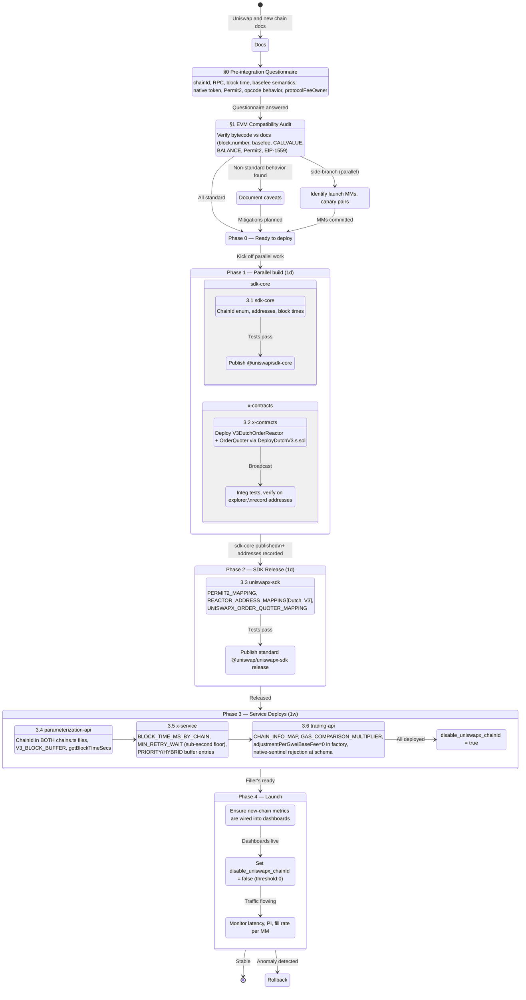

# UniswapX New-Chain Integration Playbook

This document is the runbook for bringing up UniswapX on a new EVM chain. It was distilled from the Tempo (chainId 4217) rollout (Linear TRA2-12) and is intended to make Avalanche, Robinhood, and any subsequent chain ~80% mechanical.

**Audience**: an engineer or pod that is about to enable UniswapX on a chain that already has Permit2 deployed (or is willing to deploy it) and has at least one MM/filler willing to integrate.

**Scope**: end-to-end — reactors, SDK, services, trading API, rollout. Includes the gotchas that cost us cycles on Tempo so future integrations don't repeat them.

---

## Process overview



---

## 0. Pre-integration questionnaire

Answer these before writing a single line of code. Most can be resolved against the chain's docs + a curl against its public RPC. The Tempo answers are filled in as a worked example so future readers can compare.

| Question | Why it matters | Tempo answer |
|---|---|---|
| **chainId** | Used in every repo's enums, every cosigner signature, every reactor deploy | `4217` |
| **RPC + explorer URLs** | Needed for env vars and integ tests | `https://rpc.tempo.xyz` / `https://explore.mainnet.tempo.xyz` |
| **Block time (target)** | Drives `BLOCK_TIME_MS_BY_CHAIN`, decay block-length math, status-polling cadence, Step Functions retry backoff | ~500ms |
| **Finality model** | Drives min confirmations for fills; reorg risk | Deterministic sub-second via Simplex BFT |
| **`block.number` semantics** | Decides whether `BlockNumberish.sol` needs a new branch (Arbitrum special-cases via `ArbSys`) | Standard EVM monotonic counter — no change needed |
| **`block.basefee` semantics** | Drives V3 reactor's `_updateWithGasAdjustment`; tells us whether to set `adjustmentPerGweiBaseFee = 0` | Constant `2e10` in **attodollars/gas** (1e-18 USD), NOT wei |
| **`block.timestamp` semantics** | Deadline math safety | Standard Unix seconds |
| **Native gas token** | Decides whether orders can use the `NATIVE` sentinel `address(0)` | None — Tempo uses TIP-20 USD stablecoins via Fee AMM |
| **`CALLVALUE` / `BALANCE` / `SELFBALANCE` opcodes** | Multiple reactor + sample-executor code paths read these | All three return 0 — `payable` modifiers no-op, sample-executor native sweeps inert |
| **State creation costs** | Affects filler cold-fill economics | 12.5× higher (250K gas/new slot); economically immaterial at constant low basefee |
| **Permit2 at canonical address?** | Reactor binds to a fixed Permit2 address | ✅ Yes (verified via `eth_getCode`) |
| **Sequencer / private mempool / pre-confs** | Affects RFQ exclusivity protection beyond the reactor's `ExclusivityLib` | Multi-validator with VRF leader election, no private mempool — same as other UniswapX chains |
| **EIP-1559 / typed tx support** | RPC compatibility for fillers | Yes (basefee constant, but fields are populated) |
| **Routing surfaces (UniversalRouter, etc.)** | Whether existing sample executors can be reused | Sample executors require ERC20-only sweep variants on Tempo; MMs typically roll their own |
| **protocolFeeOwner** | Address that owns the deployed reactor's protocol-fee config | Same as Arbitrum One: `0x2bad8182c09f50c8318d769245bea52c32be46cd` (unless governance overrides per-chain) |

A useful one-liner to probe basefee + block time + block-number monotonicity in one shot:

```bash
RPC=https://rpc.tempo.xyz
N=$(curl -s -X POST $RPC -H 'Content-Type: application/json' \
  -d '{"jsonrpc":"2.0","method":"eth_blockNumber","params":[],"id":1}' \
  | python3 -c "import sys,json;print(int(json.load(sys.stdin)['result'],16))")

curl -s -X POST $RPC -H 'Content-Type: application/json' \
  -d "[$(printf '{\"jsonrpc\":\"2.0\",\"method\":\"eth_getBlockByNumber\",\"params\":[\"0x%x\",false],\"id\":%d},' $((N-2)) 1 $((N-1)) 2 $N 3 | sed 's/,$//')]" \
  | python3 -c "import sys,json;[print(int(b['result']['number'],16),int(b['result'].get('timestampMillis',b['result']['timestamp']),16),b['result']['baseFeePerGas']) for b in json.load(sys.stdin)]"
```

Confirms: monotonic block number, real block time deltas, basefee value.

---

## 1. EVM compatibility audit

Run this audit against the chain's docs **and** by reading bytecode behavior on its public RPC. The two should agree; if they don't, trust the bytecode.

| Behavior | Standard EVM | UniswapX impact if non-standard |
|---|---|---|
| `block.number` monotonic & contiguous | ✅ | Need a new branch in `src/base/BlockNumberish.sol` mirroring the Arbitrum `ArbSys` special-case |
| `block.basefee` real wei value | ✅ | If constant or zero or denominated differently (Tempo: attodollars), set `adjustmentPerGweiBaseFee = 0` in `DutchV3OrderFactory` for that chain so gas-adjustment math is a no-op |
| `block.timestamp` seconds since epoch, monotonic | ✅ | Deadline checks rely on this; non-standard would break order expiry |
| `msg.value` (`CALLVALUE` opcode) reflects sent ETH | ✅ | If always 0 (Tempo): `payable` modifiers on reactor are no-ops, but the leftover-balance refund branch in `BaseReactor.sol:126` becomes dead code (harmless) — and **orders cannot use NATIVE sentinel** |
| `address(this).balance` (`BALANCE`/`SELFBALANCE`) reflects ETH balance | ✅ | If always 0 (Tempo): reactor's refund branch is dead; sample executors `UniversalRouterExecutor`, `SwapRouter02Executor`, `MultiFillerSwapRouter02Executor` have broken native sweeps — MMs need ERC20-balance variants |
| Permit2 deployed at canonical address | ✅ on most chains | If absent, deploy permit2 first via the canonical CREATE2 deployer, then UniswapX reactor binds to it |
| EIP-1559 fields populated | ✅ | Cosigner reads `baseFeePerGas` from latest block to set `startingBaseFee` (or as a tripwire) |

**Action items if any cell answers non-standard:**
1. Document in `x-contracts/README.md` under a "<Chain> deployment notes" section, mirroring the Tempo block.
2. If `block.number` is non-standard, fork `BlockNumberish.sol` with a new branch.
3. If `BALANCE`/`CALLVALUE` are non-standard, document sample-executor caveats and ensure the trading-api API boundary rejects native sentinel for that chain.
4. Set `adjustmentPerGweiBaseFee = 0` in `DutchV3OrderFactory` for any chain where basefee is constant, zero, or denominated non-standardly.

---

## 2. Repo dependency graph

Order matters because of inter-repo dependencies. The graph below is the "right" order; you can parallelize most of step 3 onward, but step 1 → 2 are gates.

```
1. @uniswap/sdk-core
       │  (adds ChainId.X enum + addresses)
       ▼
2. x-contracts                     ┐
       │  (deploy V3DutchOrderReactor + OrderQuoter)
       │
       ▼ (record reactor + quoter addresses)
3. @uniswap/uniswapx-sdk           │  parallel
       │  (register addresses)     │  with
       ▼                           │  step 3
4. x-parameterization-api          │
       │                           │
       ▼                           │
5. x-service                       │
       │                           │
       ▼                           │
6. trading-api (b/packages/services/trading) ┘
```

Steps 4–6 can be developed in parallel and pinned to the standard `@uniswap/uniswapx-sdk` release from step 3 in dev.

---

## 3. Per-repo changes

For each repo: branch off latest `main` as `<chain>-uniswapx` (e.g., `tempo-uniswapx`), commit, do **not** push until the cross-repo set is reviewed together.

### 3.1 `@uniswap/sdk-core` (in the sdks monorepo)

**Files:** `sdks/sdk-core/src/chains.ts`, `sdks/sdk-core/src/addresses.ts`

- Add `<CHAIN> = <chainId>` to the `ChainId` enum.
- Append to `SUPPORTED_CHAINS`.
- Add a `<CHAIN>_ADDRESSES` block in `addresses.ts` covering v3/v4/router contracts that exist on the chain (or empty placeholders).
- Wire into `CHAIN_TO_ADDRESSES_MAP`.
- **If the chain has no native token**, omit the WETH9 entry. There's no per-chain "native currency" map that needs special handling — just don't add an entry for chains without a native (Tempo precedent: PR #540 explicitly removed a WETH9 entry that had been added in error).
- Publish to npm before the next repo can pin against `ChainId.<CHAIN>`. If you want to unblock parallel work, downstream repos can use the numeric chain id with a `// TODO: ChainId.<CHAIN> once sdk-core is bumped` comment.

**Tempo note**: already on main as PRs #533 + #540.

### 3.2 `x-contracts`

**Files:** `script/DeployDutchV3.s.sol` (header comment), `README.md`

- Add a "<Chain> deployment notes" section in `README.md` covering: ERC20-only constraints, basefee/block.number/CALLVALUE/BALANCE behavior, sample-executor caveats.
- Add a copy-paste-runnable Tempo-style deploy invocation comment block to `script/DeployDutchV3.s.sol`. Required env var: `FOUNDRY_REACTOR_OWNER` (use the same protocolFeeOwner address as Arbitrum One: `0x2bad8182c09f50c8318d769245bea52c32be46cd`, unless governance has decided otherwise for the new chain).
- If the chain requires a `BlockNumberish.sol` branch (non-standard `block.number`), add it.

**Deploy command (production):**
```bash
FOUNDRY_REACTOR_OWNER=0x2bad8182c09f50c8318d769245bea52c32be46cd \
forge script script/DeployDutchV3.s.sol \
    --rpc-url <CHAIN_RPC> \
    --broadcast \
    --private-key $DEPLOYER_KEY
```

Same script also deploys the OrderQuoter lens (or use `script/QuoteV3Order.s.sol` / a future dedicated lens deploy script). Verify on the chain's explorer; record the addresses.

**Don't** spend cycles wiring this into the `/contracts` deployment-orchestration repo unless that repo's UniswapX deployer support has already landed — on Tempo we hit a `compilation_restrictions` conflict in `foundry.toml` where uniswapx (solc 0.8.30, no via_ir) and permit2 (solc 0.8.17, via_ir) couldn't coexist on shared interface files. The direct `x-contracts` deploy route is the proven path.

**Toolchain reproducibility — deploy from macOS only.** Every salt currently in `script/DeployOrderQuoter.s.sol` (`EXPECTED_QUOTER`) and `playbook/chains/salts.json` (`expectedReactor` per chain) was mined against bytecode produced by **macOS + forge `v1.4.4` + solc `0.8.30`** with the `foundry.toml [profile.default]` optimizer settings (enabled, `1_000_000` runs). Solc 0.8.30 embeds an IPFS metadata-hash of the source-metadata JSON in the CBOR trailer of each contract's creationCode, and that trailer is **not byte-reproducible across host platforms** — a Linux build of these same sources emits a different trailer and therefore a different CREATE2 address. If you broadcast `DeployDutchV3.s.sol` or `DeployOrderQuoter.s.sol` from a Linux host, the in-script `predicted == EXPECTED` assertion will fail and the broadcast will abort. Use a Mac (or a Mac CI runner). The previous unit test that guarded against this drift (`test/script/DeployScriptDrift.t.sol`) was removed because Ubuntu GHA runners permanently mismatch all 17 on-chain addresses and the test was unfixable without re-mining, which is impossible since the addresses are already committed on-chain.

### 3.3 `@uniswap/uniswapx-sdk`

**File:** `src/constants.ts`

- Add the chain id to `PERMIT2_MAPPING` (use `constructSameAddressMap` if Permit2 is at canonical, otherwise add as a separate entry).
- Add `[OrderType.Dutch_V3]: <reactor address>` to `REACTOR_ADDRESS_MAPPING` for the new chain id.
- Add the OrderQuoter address to `UNISWAPX_ORDER_QUOTER_MAPPING`.
- **Do NOT** add entries for `OrderType.Priority`, `OrderType.Dutch_V2`, etc., unless those reactors are also deployed on the chain. The absence of an entry is what makes `OffChainUniswapXOrderValidator.validateReactorAddress` (in x-service) reject those order types for the chain — that's the upstream guard that protects the priority/hybrid path.

**Tests:**
- Assert `V3DutchOrderBuilder(<chainId>)` resolves the reactor.
- Assert `getReactor(<chainId>, OrderType.Dutch_V3)` returns the expected address.
- Add a decay block-delta test using a chain-realistic block length (e.g. 60 blocks at 0.5s = 30s wallclock for Tempo).

### 3.4 `x-parameterization-api`

**Files:** `lib/util/chains.ts`, `lib/config/chains.ts`, `lib/constants.ts`, `lib/handlers/hard-quote/handler.ts`

- Add `<CHAIN> = <chainId>` to the `ChainId` enum in `lib/util/chains.ts`. **Also** add to `supportedChains` in `lib/config/chains.ts` (separate file, both required — Joi `chainId` validator gates inbound requests on the latter).
- Add the chain to `ID_TO_NETWORK_NAME`.
- Add `RPC_<chainId>` to `.env.example`.
- Per-chain `V3_BLOCK_BUFFER` (in `lib/constants.ts` as a map): default 4, but tune per chain. Tempo uses 1 because of fast blocks.
- Per-chain block time entry in `getBlockTimeSecs(chainId)` so `getDecayBlockLength(chainId) = ceil(V3_DEFAULT_DECAY_DURATION_SECS / blockTimeSecs)` produces sensible block counts. `V3_DEFAULT_DECAY_DURATION_SECS = 30` is the standard wallclock decay.

**Do NOT touch:**
- `lib/cron/fade-rate-v2.ts` — filler circuit-breaker logic, intentionally chain-agnostic. New chains flow through automatically (the SQL view's testnet-exclusion list correctly omits mainnet chain ids).
- `lib/repositories/fades-repository.ts` — same.

**V3 RFQ cosigning** is already implemented (TRA2-12). No further action needed unless adding a brand-new order type. If you do extend it: see Correction A below — V3 invariants are the **same direction** as V2 (swapper-improvement), not opposite.

### 3.5 `x-service`

**Files:** `lib/util/chain.ts`, `lib/util/constants.ts`, `lib/handlers/check-order-status/util.ts`, `lib/handlers/constants.ts`, `.env.example`

- `lib/util/chain.ts`: `<CHAIN> = <chainId>` to enum + `SUPPORTED_CHAINS`.
- `lib/util/constants.ts`: `BLOCK_TIME_MS_BY_CHAIN[CHAIN] = <ms>` and `OLDEST_BLOCK_BY_CHAIN[CHAIN] = <recent block>`.
- `lib/handlers/check-order-status/util.ts`: `AVERAGE_BLOCK_TIME(CHAIN)` returning the chain's block time in seconds.
- **Sub-second blocks**: if the chain's block time is < 1s, add a chain-scoped minimum wait floor in `calculateDutchRetryWaitSeconds` (e.g. `MIN_RETRY_WAIT_SECONDS_<CHAIN> = 2`). Step Functions Wait state granularity is whole seconds; sub-second values round to 0 → hot loop. Apply the floor only to the affected chain — applying globally tightens existing chains unnecessarily (the Tempo PR caught this on review).
- `lib/handlers/constants.ts`: `PRIORITY_ORDER_TARGET_BLOCK_BUFFER` and `HYBRID_ORDER_TARGET_BLOCK_BUFFER` are typed `Record<ChainId, number>` with no fallback, so the build won't pass without an entry. If the chain doesn't support priority/hybrid orders (no reactor deployed): set the entry to `0` with a comment explaining the value is unreachable because `OffChainUniswapXOrderValidator.validateReactorAddress` rejects orders whose reactor isn't in the SDK mapping.
- `.env.example`: `RPC_<chainId>=<rpcUrl>`.
- CDK is already loop-driven over `SUPPORTED_CHAINS`; no infra changes needed unless you find hardcoded chain logic.

### 3.6 `b/packages/services/trading` (Trading API)

**Files:** `src/models/chain.ts`, `src/lib/constants.ts`, `src/core/order-factory/dutch/DutchV3OrderFactory.ts`, `src/api/quote/schema.ts`

> ⚠️ **This repo drifted hard from earlier versions of this playbook.** The symbols the old playbook named (`UNISWAPX_SUPPORTED_CHAIN_IDS`, `GAS_COMPARISON_MULTIPLIER_BY_CHAIN`, `V3_BLOCK_LENGTH_BY_CHAIN`, a per-chain `disable_uniswapx_<chain>` flag) **no longer exist**. The steps below are the actual current ones (verified during the Robinhood 4663 / Arc 5042 rollout, ECO follow-on). Always re-verify against `main` — grep, don't trust this list blindly.

**There are TWO independent gates, and you must flip BOTH. Missing the second one is the bug we shipped (RFQ silently never fires — see Correction G):**

1. **`CHAIN_INFO_MAP` entry (`src/models/chain.ts`) — order *construction*.** Add `[OrderType.DUTCH_V3]: DEFAULT_DUTCH_V3_ORDER_OVERRIDE` to the chain's `orderTypeOverrides`, plus `blockTimeMs`. Mirror an existing sub-second V3 chain (Tempo). Without it, `DutchV3OrderFactory` can't build the order.
2. **`UNISWAPX_V3_ROLLOUT_CHAINS` (`src/models/chain.ts`) — RFQ *serving*.** Add `ChainId.<CHAIN>`. This is the allowlist `UNISWAPX_ROUTING_RULES` gates on. Without it, `selectApplicableUniswapXRules` finds no rule → serves `UNISWAPX_VERSION_NONE` → the quote degrades to AMM-only and **`RFQQuoter` is never invoked**. This is the modern equivalent of the old "feature flag" step.
   - Explicit `UNISWAPX_V3` requests (integrator opt-in) then serve V3 **ungated** — RFQ fires on deploy.
   - `UNISWAPX_LATEST` (Uniswap frontend) traffic is sampled behind the global `ConfigKey.UNISWAPX_V3_ROLLOUT` FeatureFlag. Confirm that flag's threshold for frontend exposure; explicit-V3 callers don't depend on it.

**Other per-chain settings:**
- `src/lib/constants.ts` → `CONSTANT_BASE_FEE_CHAINS`: add the chain **only if its base fee is fixed** (Tempo, Arc). `DutchV3OrderFactory` reads `hasConstantBaseFee(chainId)` and sets `adjustmentPerGweiBaseFee = 0` (Correction B). A chain on real EIP-1559 — even one usually pinned at a floor, like Robinhood — does **not** go here.
- **Native sentinel for no-native chains**: the current code **rewrites** `0x0` → the chain's canonical ERC-20 via `NATIVE_CURRENCY_ADDRESSES_PER_CHAIN[CHAIN]` in `src/api/quote/schema.ts` (for both tokenIn and tokenOut), rather than hard-rejecting. Add that mapping entry (mirror Celo/Tempo). For Arc this maps to the 6-decimal USDC ERC-20 — same safety goal (no decimal ambiguity), different mechanism than the old "reject" advice.

**No longer needed (the code became generic — do NOT re-add per-chain entries):**
- **Block length**: `getV3BlockLength(chainId) = secondsToBlocks(V3_DECAY_DURATION_SECS, chainId)` derives from sdk-core's per-chain block time. No `V3_BLOCK_LENGTH_BY_CHAIN`.
- **Gas comparison**: derives from the classic routing quote's gas-adjusted amounts. No `GAS_COMPARISON_MULTIPLIER_BY_CHAIN`.
- **RFQQuoter protocol version**: request-driven (`protocolToProtocolVersion(params.protocols)`), not per-chain.
- **`WRAPPED_NATIVE_CURRENCY`**: only for chains with a real native token.

**Dependency bumps (easy to miss — both downstream-pinned, see Correction H):**
- Bump `@uniswap/sdk-core` to a version that contains the chain's `ChainId` **and** its `AVERAGE_BLOCK_TIMES_SECONDS` entry (`getV3BlockLength`/`getV3BlockLengthOrUndefined` throw/skip without it).
- Bump `@uniswap/uniswapx-sdk` to the release carrying the new chain's `REACTOR_ADDRESS_MAPPING` entry.

**Tests** to add per chain:
- Routing: explicit `UNISWAPX_V3` resolves to `UNISWAPX_V3` for the chain (`uniswapxRouting.test.ts`) — guards gate #2.
- `getV3BlockLength` returns the expected count; `hasConstantBaseFee` returns the right value (`constants.test.ts`).
- If the chain has no native, `WrapUnwrap*` chain iteration excludes it (mirror existing Celo/Tempo handling).

---

## 4. Common gotchas (corrections discovered the hard way)

### Correction A: V3 cosigner-amount invariants are the SAME direction as V2

If you're extending the parameterization-api or implementing a new RFQ branch: V3's `_updateWithCosignerAmounts` (in `x-contracts/src/reactors/V3DutchOrderReactor.sol`) enforces the same swapper-improvement direction as V2:

- `inputOverride ≤ baseInput.startAmount` (cosigner can only **reduce** input)
- `outputOverride ≥ baseOutput.startAmount` (cosigner can only **increase** output)

The original Tempo TDD claimed these were "opposite from V2." That was wrong. Mirror the V2 RFQ override-validation flow exactly.

### Correction B: V3 gas-adjustment fields live on the swapper-signed payload, NOT on cosigner data

`adjustmentPerGweiBaseFee` and `startingBaseFee` are fields on `UnsignedV3DutchOrderInfo` (the swapper-signed struct), not on `V3CosignerData`. The cosigner physically **cannot** zero them out at signing time — they're already in the signed payload.

The actual lever is on the **order construction side**: `DutchV3OrderFactory` in trading-api sets these values when the unsigned order is built. So per-chain "zero out the gas adjustment for chain X" lives in trading-api's factory, not in parameterization-api's cosigner.

The parameterization-api can still read the live `block.basefee` as a **tripwire** and refuse to cosign if the swapper-signed `startingBaseFee` diverges materially from the observed value (TODO; not implemented as of Tempo).

### Correction C: ChainId enums live in TWO places in parameterization-api

Both `lib/util/chains.ts` AND `lib/config/chains.ts` need the new chain. The latter gates inbound request validation via Joi; the former is consumed everywhere else. Forgetting the second one means the API rejects Tempo requests at validation even though the cosigner code knows about the chain.

### Correction D: Sub-second blocks need a chain-scoped retry floor

Step Functions Wait state granularity is whole seconds. A `0.5s` retry rounds to `0` → hot loop. Add a chain-scoped floor (`MIN_RETRY_WAIT_SECONDS_<CHAIN>`), not a global one — global floors tighten Arbitrum/Unichain unnecessarily.

### Correction E: Don't treat "stablecoin native" as wrapped-native

For chains with no native token, do **not** set `WRAPPED_NATIVE_CURRENCY[CHAIN] = <some stablecoin>`. That's a category error: there are usually multiple stablecoins, and picking one auto-rewrites silent `0x0` → that stablecoin even when the user wanted a different one. Instead, hard-reject native-sentinel addresses at the API boundary and force clients to specify a real ERC20.

### Correction F: Don't worry about state-creation gas overhead

Chains with elevated state-creation costs (Tempo: 12.5×) sound scary but are economically immaterial when basefee is sub-cent. 250K gas × `2e10` attodollars/gas = $0.005. Don't over-engineer pricing for this — let fillers absorb it.

### Correction G: Trading API has TWO gates — wiring DUTCH_V3 ≠ serving it (the one that bit us on Robinhood/Arc)

This is the highest-value lesson in the doc. On the Robinhood/Arc rollout we deployed everything — reactors, SDK, param-api, x-service, and trading-api's `CHAIN_INFO_MAP` `DUTCH_V3` override — and **RFQ still never fired**. No errors; quotes silently came back AMM-only.

Cause: trading-api gates UniswapX in **two independent places**, and we'd only flipped one:

1. `CHAIN_INFO_MAP[chain].orderTypeOverrides[OrderType.DUTCH_V3]` — lets the factory **construct** a V3 order.
2. `UNISWAPX_V3_ROLLOUT_CHAINS` (consumed by `UNISWAPX_ROUTING_RULES` / `selectApplicableUniswapXRules` in `lib/util/uniswapxRules.ts`) — decides whether to **serve/offer** UniswapX at all. If the chain isn't in this allowlist, the router serves `UNISWAPX_VERSION_NONE`, the request degrades to AMM-only, and `RFQQuoter` is never even called.

You can have #1 without #2 and everything looks wired but produces zero RFQs. **Always add the chain to `UNISWAPX_V3_ROLLOUT_CHAINS` and add a routing test asserting explicit `UNISWAPX_V3` resolves to V3 for the chain.** This allowlist (+ the global `ConfigKey.UNISWAPX_V3_ROLLOUT` sampling flag for `UNISWAPX_LATEST` frontend traffic) is what the old playbook meant by "the feature flag."

**Debugging note:** the `requestId` in a `/quote` response is the API-Gateway/quote ID. The RFQ sub-request to the param-api gets its **own fresh UUID** (`RFQQuoter` calls `this.uuidGenerator()`). Searching the RFQ/param-api service for the quote's requestId will never match — correlate by APM trace, swapper, or timestamp. Also note `trading` and the param-api (`goudaservice`) ship to **APM/their own log pipelines**, not the default indexed `service:` log view — search spans, and expect service-name/log-index quirks.

### Correction H: Downstream repos pin SDK versions — bump them, a published SDK isn't enough

`sdk-core` and `uniswapx-sdk` being published with the new chain is necessary but **not sufficient**. Each consumer (parameterization-api, x-service, trading-api) pins a specific version, and those pins are routinely stale:

- On Robinhood/Arc, all three were pinned to `@uniswap/sdk-core` `7.14.0` — which predated the chains (`ChainId.ARC` undefined, `ChainId.ROBINHOOD` still the **46630 testnet** id). Code referencing `ChainId.<CHAIN>` won't compile, and `getAverageBlockTimeSecs`/`secondsToBlocks` **throw** for unregistered chains.
- x-service additionally needs the `uniswapx-sdk` bump for `REACTOR_ADDRESS_MAPPING` — `OffChainUniswapXOrderValidator.validateReactorAddress` rejects orders whose reactor isn't in the mapping.

Per repo: confirm the installed version actually resolves `ChainId.<CHAIN>` to the mainnet id and (for the SDKs) contains the block-time + reactor entries — `node -e "const {ChainId}=require('@uniswap/sdk-core');console.log(ChainId.<CHAIN>)"`. Bump the pin if not. Also mind release ordering: a published patch version can't be republished, so a follow-up SDK change needs a fresh version (we bumped `uniswapx-sdk` 3.0.8→3.0.10 after 3.0.8/3.0.9 had shipped).

### Correction I: Corrections C and D are stale as of the Robinhood/Arc rollout

The parameterization-api and x-service refactored since Tempo — re-verify before applying C/D:
- **C (two ChainId places in param-api):** now a single `SUPPORTED_CHAINS` in `lib/util/chains.ts` is the source of truth for both the quote injectors and the Joi validator. `lib/config/chains.ts` no longer exists. Per-chain block config is generic via sdk-core (`getV3BlockBuffer` → `secondsToBlocks`), so a chain just needs adding to `SUPPORTED_CHAINS`.
- **D (chain-scoped retry floor in x-service):** `calculateDutchRetryWaitSeconds` already applies a **global** `Math.max(MIN_RETRY_WAIT_SECONDS = 1, …)`, so sub-second chains can't hot-loop. No per-chain floor needed (Tempo, also sub-second, relies on the global one). Block time is sourced from sdk-core (`getAverageBlockTimeSecs`), not a per-chain `BLOCK_TIME_MS_BY_CHAIN`. x-service still needs the chain in `SUPPORTED_CHAINS` + `OLDEST_BLOCK_BY_CHAIN`; it follows the Tempo precedent of being **absent** from `PRIORITY/HYBRID_ORDER_TARGET_BLOCK_BUFFER` (V3-only chains).

---

## 5. Rollout plan template

See the [Process overview](#process-overview) diagram at the top of this document for the state-machine view. Phases below match it 1:1.

**Pre-work (parallel side-branch off the §1 EVM audit)**
- Identify launch MMs (any MM that supports the chain receives RFQs once launched — no whitelist).
- Decide canary stablecoin pairs.
- protocolFeeOwner is captured in the §0 questionnaire.

**Phase 0 — Ready to deploy**
- Gate confirming §0 questionnaire + §1 EVM audit + MM alignment are all complete.

**Phase 1 — parallel build (1 day)** — sdk-core and x-contracts run in parallel:
- *sdk-core branch*: §3.1 changes, tests, publish standard `@uniswap/sdk-core` release.
- *x-contracts branch*: Deploy `V3DutchOrderReactor` + `OrderQuoter` lens via `script/DeployDutchV3.s.sol`. Integration tests against the live chain. Verify on the chain's explorer. Record addresses.

**Phase 2 — SDK release (1 day)**
- Replace zero-address placeholders in `uniswapx-sdk/src/constants.ts` with real reactor + quoter addresses.
- Publish a standard `@uniswap/uniswapx-sdk` release (no canary needed — downstream repos pin the normal version).

**Phase 3 — service deploys (1 week)**
- Pin trading-api / x-service / parameterization-api to the new SDK release in dev.
- Deploy parameterization-api → x-service → trading-api in that order.
- `disable_uniswapx_<chain>` flag stays ON throughout (= UniswapX OFF on the chain).
- Internal security review of any new cosigning logic.
- Exit criterion: filler(s) ready and services healthy.

**Phase 4 — launch**
1. Ensure new-chain metrics are wired into dashboards (latency, PI, fill rate per MM, decay block math, gas-adjustment, Step Functions retry cadence, `compareQuotes` selection).
2. Set `disable_uniswapx_<chain>` to `false` (`{"threshold": 0}`). UniswapX routing is now available to any TAPI caller that opts into UniswapX, and all MMs that support the chain receive RFQs.
3. Monitor.

**Rollback**: `disable_uniswapx_<chain> = true` short-circuits routing to Classic-only on the chain. Order posting can be disabled in x-service via `SUPPORTED_CHAINS` redeploy. No on-chain rollback needed — unused reactors are inert.

---

## 6. Tempo case study (TRA2-12)

All work landed across the following PRs (each links back to Linear TRA2-12):

| Repo | PR |
|---|---|
| `x-contracts` | [Uniswap/UniswapX#367](https://github.com/Uniswap/UniswapX/pull/367) |
| `sdks/sdk-core` | [Uniswap/sdks#533](https://github.com/Uniswap/sdks/pull/533), [Uniswap/sdks#540](https://github.com/Uniswap/sdks/pull/540) |
| `sdks/uniswapx-sdk` | [Uniswap/sdks#577](https://github.com/Uniswap/sdks/pull/577) |
| `x-parameterization-api` | [Uniswap/uniswapx-parameterization-api#438](https://github.com/Uniswap/uniswapx-parameterization-api/pull/438) |
| `x-service` | [Uniswap/uniswapx-service#654](https://github.com/Uniswap/uniswapx-service/pull/654) |
| `b/packages/services/trading` | [Uniswap/backend#7813](https://github.com/Uniswap/backend/pull/7813) |

### Robinhood (4663) + Arc (5042) — second multi-chain rollout

The reference diffs for "what a rollout actually looks like against current `main`" (more accurate than the Tempo PRs above, since several repos refactored since). Note trading-api needed **two** PRs — the second (`#9615`) is the serving gate that #9599 missed (Correction G):

| Repo | PR |
|---|---|
| `x-contracts` (reactors + `BlockNumberish` 4663 branch) | [Uniswap/UniswapX#371](https://github.com/Uniswap/UniswapX/pull/371) |
| `sdks/uniswapx-sdk` (reactor/quoter/exclusive-filler maps + 3.0.10) | [Uniswap/sdks#615](https://github.com/Uniswap/sdks/pull/615) |
| `x-parameterization-api` (SUPPORTED_CHAINS + sdk-core bump) | [Uniswap/uniswapx-parameterization-api#457](https://github.com/Uniswap/uniswapx-parameterization-api/pull/457) |
| `x-service` (SUPPORTED_CHAINS, OLDEST_BLOCK, sdk-core + uniswapx-sdk bumps) | [Uniswap/uniswapx-service#685](https://github.com/Uniswap/uniswapx-service/pull/685) |
| `b/packages/services/trading` (CHAIN_INFO_MAP + CONSTANT_BASE_FEE + sdk bump) | [Uniswap/backend#9599](https://github.com/Uniswap/backend/pull/9599) |
| `b/packages/services/trading` (**serving gate** — `UNISWAPX_V3_ROLLOUT_CHAINS`) | [Uniswap/backend#9615](https://github.com/Uniswap/backend/pull/9615) |

sdk-core was a no-op (both `ChainId`s already shipped). Robinhood is Arbitrum Orbit → needed a `BlockNumberish` 4663 branch (ArbSys block number) + a fresh mined salt; Arc is a non-canonical owner so also got its own mined salt. Both chains' per-chain research lives in [`chains/robinhood.md`](./chains/robinhood.md) and [`chains/arc.md`](./chains/arc.md).

---

## 7. Next-chain quick-start

Run the §0 questionnaire and §1 audit first. Most of the diff is additive (new entries in maps/enums), but **"additive" does not mean "safe to skim"** — the Robinhood/Arc rollout shipped with V3 fully wired yet serving zero RFQs because the `UNISWAPX_V3_ROLLOUT_CHAINS` serving gate was missed (Correction G). Treat §3.6's "two gates" and Corrections G/H as a checklist, and re-grep every named symbol against `main` (this playbook drifts).

Minimum end-to-end checklist for a standard EVM chain:
- [ ] sdk-core: `ChainId.<CHAIN>` + `AVERAGE_BLOCK_TIMES_SECONDS` entry shipped (often already done).
- [ ] x-contracts: reactor + OrderQuoter deployed (mine salt; Orbit chains need a `BlockNumberish` branch).
- [ ] uniswapx-sdk: `REACTOR_ADDRESS_MAPPING` / quoter / exclusive-filler entries, published.
- [ ] param-api: add to `SUPPORTED_CHAINS`; bump sdk-core pin.
- [ ] x-service: `SUPPORTED_CHAINS` + `OLDEST_BLOCK_BY_CHAIN`; bump sdk-core **and** uniswapx-sdk pins.
- [ ] trading-api **gate #1**: `CHAIN_INFO_MAP` `DUTCH_V3` override + `blockTimeMs`.
- [ ] trading-api **gate #2**: `UNISWAPX_V3_ROLLOUT_CHAINS` (← the one we missed) + bump uniswapx-sdk pin.
- [ ] trading-api: `CONSTANT_BASE_FEE_CHAINS` (only if fixed basefee); native-sentinel mapping (no-native chains).
- [ ] Verify with a real explicit-`UNISWAPX_V3` quote in prod and confirm an RFQ span/log appears; set `UNISWAPX_V3_ROLLOUT` threshold for frontend traffic.

**Avalanche specifics** (if/when done): standard `block.number` + EIP-1559 basefee; native AVAX, `WRAPPED_NATIVE_CURRENCY = WAVAX`; ~2s blocks; verify Permit2 via `eth_getCode`.

When a chain lands, file a follow-on Linear ticket and add a row to §6's case-study table.
